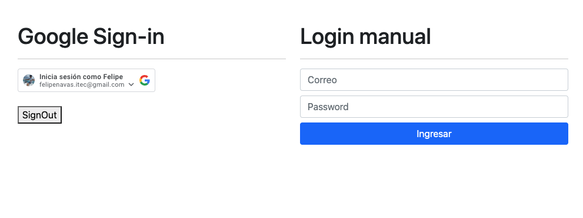

# Websocket Server

A Web Socket Server for chat in `node.js`

## Description

A Websocket Server in `node.js` that uses `express` and `socket.io`.
In this app I use different methods to make a chat client and a backend server using web sockets with `socket.io`.

## Getting Started

### Dependencies

- `npm`
- `node`

### Installing

- Clone the repository and install dependencies:

```
git clone https://github.com/Felipe-Navas/websocket-server-chat.git && cd websocket-server-chat && npm install
```

- Create a `.env` file in the root of the project and configure the following:
    * Add the content of ".example.env" into your new ".env" file
        * `PORT`: In this variable add the port number where the server will run
        * `MONGOBD_CNN`: mongodb+srv://<user>:<password>@<micluster>.ml5uh.mongodb.net/test
            * Go to https://cloud.mongodb.com and create an user
            * Create a new cluster
            * Add a new Database User, in the section SECURITY -> Database Access
            * Get the connection string in the section DEPLOYMENT -> Databases, clicking in "Connect"
            * Modify the the password in your connection string
        * `SECRETOPRIVATEKEY`: In this variable create a secure password for the token generation
        * `GOOGLE_CLIENT_ID`: In this variable set your google client id
        * `GOOGLE_SECRET_ID`: In this variable set your google secret id
        * `CLOUDINARY_URL`: In this variable set your "API Environment variable" of your account in https://cloudinary.com/

* Google authentication
    * Go to https://developers.google.com/identity/gsi/web/guides/get-google-api-clientid
    * Create a new proyect in https://console.cloud.google.com/apis/dashboard
    * Configure your OAuth Consent Screen https://console.cloud.google.com/apis/credentials/consent?project=your_proyect_name
    * Create your credentials https://console.cloud.google.com/apis/credentials?project=your_proyect_name
    * Modify the data-client_id in the /public/index.html file with your google client id
### Executing program

```
npm start
```

Preview of the principal page to login:



Preview of the screen of chat:


### Running tests

```
npm test
```

## Authors

- [Felipe Navas](https://www.linkedin.com/in/felipenavaslederhos) - [Email](mailto:felipenavas.itec@gmail.com?subject=[GitHub]%20websocket-server-chat)

## Contributing

1. Fork it (<https://github.com/Felipe-Navas/websocket-server-chat/fork>)
2. Create your feature branch (`git checkout -b feature/fooBar`)
3. Commit your changes (`git commit -am 'Add some fooBar'`)
4. Push to the branch (`git push origin feature/fooBar`)
5. Create a new Pull Request

## License

This project is licensed under the [MIT License] - see the LICENSE file for details
